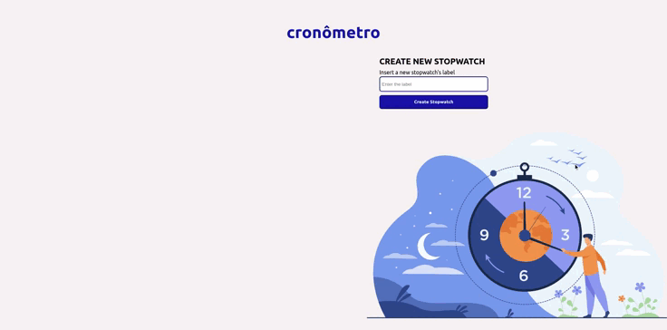

<div id="top"></div>
<!--
*** Thanks for checking out the Best-README-Template. If you have a suggestion
*** that would make this better, please fork the repo and create a pull request
*** or simply open an issue with the tag "enhancement".
*** Don't forget to give the project a star!
*** Thanks again! Now go create something AMAZING! :D
-->

<!-- PROJECT LOGO -->
<br />
<div>
  <h1 align="center">cronômetro</h1>
  <p align="center">A timer for task made with JavaScript</p>
</div>

<!-- TABLE OF CONTENTS -->
<details>
  <summary>Table of Contents</summary>
  <ol>
    <li>
      <a href="#about-the-project">About The Project</a>
      <ul>
        <li><a href="#cronômetro">cronômetro</a></li>
	<li><a href="#built-with">Built With</a></li>
      </ul>
    </li>
    <li>
      <a href="#getting-started">Getting Started</a>
      <ul>
	<li><a href="#prerequisities">Prerequisities</a></li>
        <li><a href="#installation">Installation</a></li>
      </ul>
    </li>
    <li><a href="#usage">Usage</a></li>
    <li><a href="#roadmap">Roadmap</a></li>
    <li><a href="#contributing">Contributing</a></li>
    <li><a href="#license">License</a></li>
    <li><a href="#contact">Contact</a></li>
    <li><a href="#acknowledgments">Acknowledgments</a></li>
  </ol>
</details>

<!-- ABOUT THE PROJECT -->
## About The Project
This project was created to fulfill the task of making a mini project in a web development course. Therefore, we build an application, namely:

### cronômetro
cronômetro (in Italian) or commonly known as a stopwatch (in English) is an application that includes a timer that can help us to calculate how long we take to do assignments or study in certain subjects.
 This application also has several features, including :
- Timer
- Multiple timer
- Save timer
- History

<p align="right">(<a href="#top">back to top</a>)</p>

### Built With
* HTML
* CSS
* VueJS
* NodeJS
* PostgreSQL

<p align="right">(<a href="#top">back to top</a>)</p>

<!-- GETTING STARTED -->
## Getting Started

### Prerequisities
1. Install [NodeJS](https://nodejs.org/en/) and install yarn using `npm install -g yarn'
2. Install [PostgreSQL](https://www.postgresql.org/download/)

### Installation

1. Clone the repository
	```sh 
	 git clone https://github.com/ReyRizki/kel1-timer-jquery.git
	 ```
2. Configure PostgreSQL database
    * Create database with name cronometro
    * cd to `back-end/db` and type `\ir timer.ddl` in PostgreSQL shell
3. Configure back-end
    * cd to `back-end` and install packages with `yarn install`
    * Copy `.env.example` to `.env`. Fill PORT with your desired API port or leave blank. Fill DB_USER and DB_PASSWORD with your database user and password
    * Run the server with `npx nodemon index.js`
4. Configure front-end
    * cd to `front-end` and install packages with `yarn install`
    * Run the server with `yarn serve`
    * Open http://localhost:8080/ in your browser

<p align="right">(<a href="#top">back to top</a>)</p>

<!-- USAGE EXAMPLES -->
## Usage
<div>
	
</div>

To use this app, you can:

1. Ceate a new stopwatch with your desired label
2. Run the stopwatch. You can also pause the stopwatch at any time
3. Stop the stopwatch
4. See the history of recorded time
5. Remove the stopwatch if not needed anymore

<p align="right">(<a href="#top">back to top</a>)</p>

<!-- ROADMAP -->
## Roadmap
- [x] Create Timer Functionality 
- [x] Fix Bugs
- [x] Create Mock Up
- [x] Add Styling 
- [x] Write Documentation
- [x] Create database model
- [x] Create API
- [x] Connect front-end to back-end 
- [x] Refactor to use Vue.js

<p align="right">(<a href="#top">back to top</a>)</p>

<!-- CONTRIBUTING -->
## Contributing

Contributions are what make the open source community such an amazing place to learn, inspire, and create. Any contributions you make are **greatly appreciated**.

If you have a suggestion that would make this better, please fork the repo and create a pull request. You can also simply open an issue with the tag "enhancement". Don't forget to give the project a star! Thanks again!

Don't forget to give the project a star! Thanks again!

To add the project to your computer within this contribution you could do:
1. Open command prompt
2. `cd` to the destination that you desire on your PC
3. `git clone https://github.com/ReyRizki/kel1-timer-javascript.git`
4. And voila! the project is now on your PC!

To upload your changes of the project you could create a new branches for it within ths steps on your command prompt:
1. `git checkout -b new branch name`
2. It is automatically switch branch to the new branch from the main branch
3. Add your stuff! with git add .
4. Then commit `git commit -m "the commit"`

Rules of "the commit"
the commit must has these process of writings:
`<kind of commit>(feature):<title>`
There are 3 kinds of commit that we used for contributions:
1. **Feature** - the objectives of this commit is to announce the new feature of the project
2. **Chore** - the objectives of this commit is to announce bugs that has been fixed
3. **Refactor** -  the objectives of this commit is to announce the refactor of the codes

You could also concise the kind of commits with `ft` for feature, `ch` for chore, and `re` for refactor

The title must describe the details of changes or a feature

And lastly push your work,
`git push -u origin branch name`

Options!
switches branches use this command on command prompt:
`git checkout branch name`

<p align="right">(<a href="#top">back to top</a>)</p>

<!-- LICENSE -->
## License

Distributed under the MIT License. See `LICENSE` for more information.

<p align="right">(<a href="#top">back to top</a>)</p>

<!-- CONTACT -->
## Contact

* [Amalia Hajarani](https://github.com/amaliahajarani21)
* [Farra Jessica](https://github.com/FarraJessica)
* [Irsyad Muhammad](https://github.com/imsyad)
* [Marcell Ivaldri](https://github.com/mivaldrii)
* [Muhammad Hargi](https://github.com/Bogel-47)
* [Reynaldy Rizki](https://github.com/ReyRizki)


<p align="right">(<a href="#top">back to top</a>)</p>

<!-- ACKNOWLEDGMENTS -->
## Acknowledgments

* [StackEdit](https://stackedit.io/)
* [ReadMe Template](https://github.com/othneildrew/Best-README-Template)

<p align="right">(<a href="#top">back to top</a>)</p>

<!-- MARKDOWN LINKS & IMAGES -->
<!-- https://www.markdownguide.org/basic-syntax/#reference-style-links -->
[product-video]: images/usage.gif
